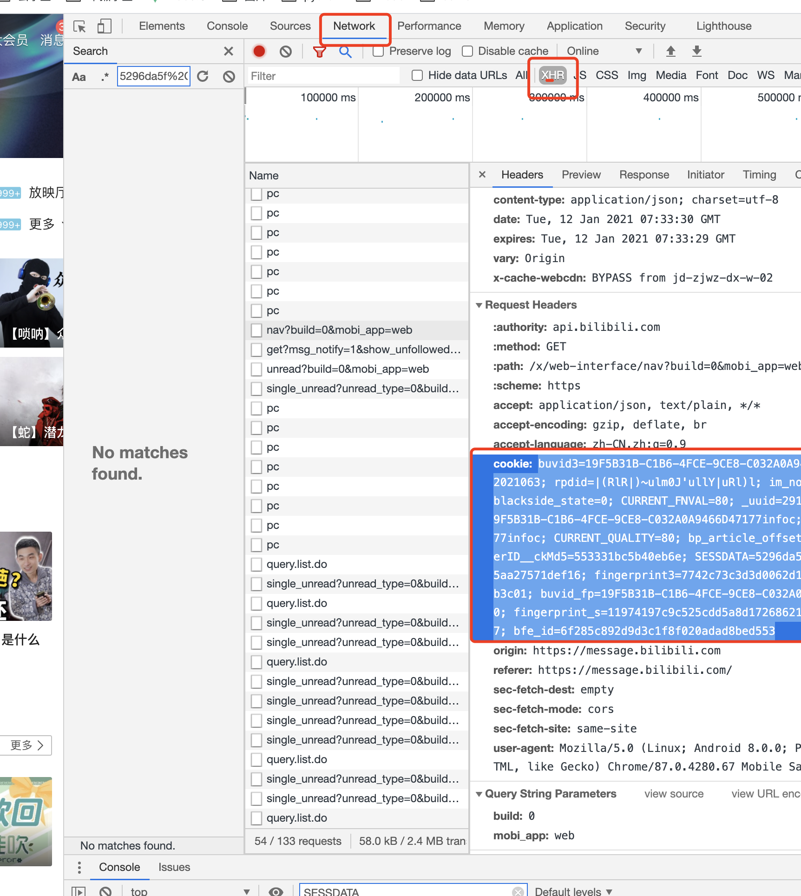

# 项目来源于[kamiyan233/bilibili-helper](https://github.com/kamiyan233/bilibili-helper)

本项目删除了`投币功能`，~~誓将白嫖进行到底~~。

保留bilibili获取经验任务，直播签到，漫画签到，转发，观看视频。

完整功能请参考原项目。

# 本项目在原项目的基础上可以使用GitHub Action功能实现每日自动化运行。

## 使用方法

0. **写在前面：请在自己fork的仓库中修改，并push到自己的仓库，不要直接修改本仓库，也不要将您的修改pull request到本仓库（对本仓库的改进除外）！如果尚不了解github的基本使用方法，请参阅[使用议题和拉取请求进行协作/使用复刻](https://docs.github.com/cn/github/collaborating-with-issues-and-pull-requests/working-with-forks)和[使用议题和拉取请求进行协作/通过拉取请求提议工作更改](https://docs.github.com/cn/github/collaborating-with-issues-and-pull-requests/proposing-changes-to-your-work-with-pull-requests)。**

1. 将本代码仓库fork到自己的github。

2. 点击Actions选项卡，点击`I understand my workflows, go ahead and enable them`.

3. 点击Settings选项卡，点击左侧Secrets，点击New secret，创建名为`COOKIE`，值为。用同样方法，创建名为`SCKEY`，值为Server酱的SendKey值，具体获取方式请百度。这两个值不会被公开。

   

4. 默认的打卡时间是每天的每天8点，13点执行任务，可能会有数分钟的浮动。如需选择其它时间，可以修改`.github/workflows/report.yml`中的`cron`，详细说明参见[安排的事件](https://docs.github.com/cn/actions/reference/events-that-trigger-workflows#scheduled-events)，请注意这里使用的是**国际标准时间UTC**，北京时间的数值比它大8个小时。建议修改默认时间，避开打卡高峰期以提高成功率。

5. 在Actions选项卡可以确认打卡情况。

## 用户参数获取
#### COOKIE
F12 network -> 随便找个请求 -> 复制请求头cookie

#### SCKEY
`server酱`链接：`https://sct.ftqq.com/`

